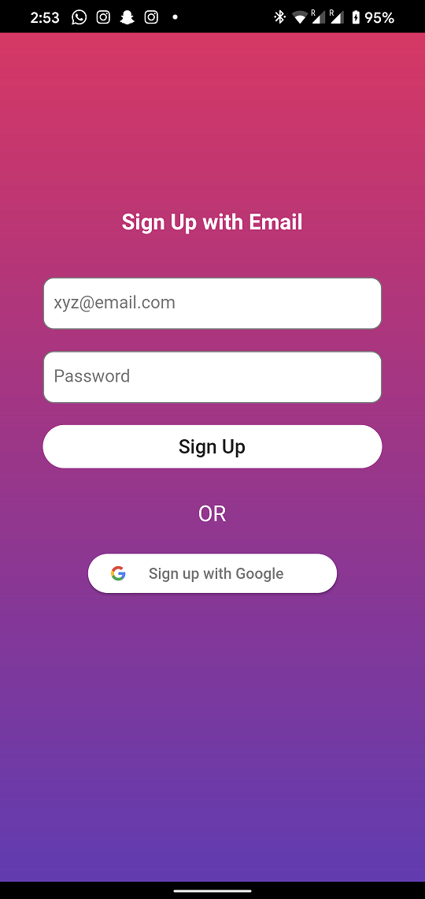

# **Project Information**

## Project Title

A hyperlocal e-commerce platform

## Project Description

An advanced project of making a full-stack hyperlocal e-commerce platform which focuses on providing all the products from your nearby retail shops. This project will help you apply all your flutter and android dev skills in one place and make a powerful and good looking android application.

## Author

swapnilsingh1023@gmail.com
 

## Collaborator(s)

 

## Project Language(s)

dart, js
 

## Difficulty

Advanced
 

## **Duration**

80 hours

## **Prerequisite(s)**

Flutter, dart, js(Basics)

## **Skills to be learned**

Advanced flutter, Firebase, Android application development, making an online paymet gateway using paytm API, full stack development of a highly scalable application.

# **Project Metadata**

## **Project Id** 

PROJECT_HYPERLOCAL_ECOMMERCE

## **Slug URL** 

react-hyperlocal-ecommerce
## **Keywords**

flutter developement, dart, flutter, firebase, firestore, cloud functions, paytm payment gateway, push notifications, javascript, project, node.js

## **Category**

Java

## **Focus** 

flutter, dart, Firebase, firebase cloud functions, firebase cloud messaging, android application development

# **Overview**

## **Objective** 

You will be making a hyperlocal e-commerce platform using flutter and dart, while keeping the data base on firestore and further using cloud functions to implement few other functionalities of the application like an online payment gateway. 

## Project Context 
With each day, the hold of bulky e-commerce industries like Amazon, Flipkart etc is increasing. This is bringing a hard time for the small local retailers and businesses. The increasing ease of buying products online makes it harder for the local businesses to compete in the market.

Hyperlocal businesses are the one where one wants to build a local ecosystem that enables customers to buy anything from their neighborhood stores.

Hyperlocal has two major dimensions: geography and time. Its content is targeted people or entities that are located within a well-defined area, generally on the scale of a street, neighborhood, community, or city.
 

The hyperlocal eCommerce system helps the customers to connect with local stores of particular geographical regions and giving customers a better experience of shopping by providing them fast delivery of the purchased products. Thus Hyperlocal Marketplace is the next generation in transforming e-commerce for both sellers and customers.

This project is a challenging project for beginners, the perfect project idea for intermediates and a routine project for professionals. This project uses an intermediate-advanced level flutter-dart concepts and moderate knowledge of Firebase databases. 

## Product Stages

We can divide the application architecture in the following :

- Flutter - Application’s frontend and core-functionalities
- Firebase - Integrating the database on firestore with the frontend.
- Cloud functions - writing few functions to implement few features like push notifications and payment gateway.
- GitHub - To publish your work

## High-Level Approach 

- Setting up the UI part of the application, making all the different pages and the UX, this will gradually help you understand how the final widget tree is going to look like. We will be using few different flutter packages to add that extra premium touch to our UI.
- Intigrating the firestore database to populate data on the frontend.
- making authentication using firebase auth.
- Slightly bending the widget tree to enable our application in quering location based documents. This will help us with the hyperlocal part of the application. 
- Create extra features like push notifications and Paytm payment gateway.
- Publish to GitHub.

The desired end result of this project is like [this](https://play.google.com/store/apps/details?id=com.porsio.www&hl=en_IN&gl=US).

## Primary goals 

- Build an e-commerce app from scratch using flutter and secure the app with proper authentication using Firestore as the database.

# **Task_id = 1**

## Task Title

Initial setup
 

## Initial setup

I recommend installing VSCode along with the Flutter and Dart plugins to start developing apps.

## Requirements
- If you're using the flutter framework for the first time, I'd suggest you to go online and get a basic idea of what flutter is and how does it work. It'll help you connect better with the work that you're going to be doing.
- We will setup the basic skeleton of the app first. If you are making a Flutter app for the first time, refer this [page](https://flutter.dev/docs/get-started/codelab). After successfully setting up your new flutter project, we will now make two directories:
    - UI - this will store the dart files of all the screens and pages.
    - Functionalities - this will store all the other dart files like `firestore_service.dart` which will have all the CRUD functions for the firestore, `auth.dart` which will have all the firebase authentication related code and similarly other dart files which simply just run in the background at all time and is further needed by other dart files in the UI directory.

    The file structure for the completed app would be similar to the image below.

    

- We're also going to need few flutter packages available at [pub.dev](https://pub.dev/). For which we need to add few dependencies in `pubspec.yaml` file, which should then look like - 

    

- After setting up the project, we'll set up the firestore project and make the skeleton database structure:

    1. If you're using firebase for the first time, I'd recommend you to check this [page](https://firebase.google.com/docs/firestore/quickstart) out.
    2. Make a clean structure of how your database should look like. Decide what all collections should be incorporated and the further decide the structure and fields of the documents in each collection. You should atleast have these discrete collections - 
          - users - store all the user documents.
          - products - store all the product documents.
          - shops - store all the shop data.
          - orders - store all the orders placed by all the customers.
      
            we'll discuss more on how the doccuments in each collection should look like in the later sections.

    3.   Once you've made the skeleton of the database, it's time to connect your database with the application. Check this [page](https://firebase.google.com/docs/flutter/setup) out for a detailed walk-through.
        
- Search for different basic flutter packages and start using them for your own testing purpose.

### References

- [flutter.dev](https://flutter.dev/)
- [Setting up flutter app](https://flutter.dev/docs/get-started/test-drive)
- [Quick tutorial and reference for flutter](https://flutter.dev/docs/reference/tutorials)
- [Find and use flutter packages](https://pub.dev/) 
- [Firebase](https://firebase.google.com/docs/web/setup) quick reads - [1](https://medium.com/@efebu/a-step-by-step-firebase-tutorial-46f918cb958), [2](https://medium.com/firebase-developers/what-is-firebase-the-complete-story-abridged-bcc730c5f2c0)
- [.gitignore](https://www.pluralsight.com/guides/how-to-use-gitignore-file)

## Bring it On! 
- Try to figure out the document structure of each collection.
- Create all the custome CRUD fuctions that you think you'll be needing in the `firestore_service.dart` file.
- Check the security rules of your firestore project.

## Expected outcome:
-  You should have the project setup complete along with the firebase project connected to it.

# **Task_id = 2**

## Task Title

Making pages, UI and integrating data from firestore.
 

## Making pages and UI and intigrating data from firestore

An important thing to note while making the screens and using the variables that power your app, is state management.

### State management
There are different options you can take to manage state in your application. I'll list a few of them below:
 

#### Streams (BLoC)

The BLoC principle can be used to provide fast, reactive state management. The changes in variables are reflected almost instantly. Check widgets like stream builders etc.

To handle asynchronous data, I'd recommend using widgets like futures and future builders. 

 

It however, requires some initial set-up and boilerplate code to get it running. Research articles on how to build reactive apps on Flutter and this might help you get started on it. 

 

#### Constructors 

You can transfer variables between different screens using their constructors. It is the easiest way to achieve state management. 

 

It however gets a bit complex with increasing state variables and might lead to complications, further into development. 

 

## Requirements
- [Research](https://uxplanet.org/best-practices-in-mobile-app-design-in-2020-7f5026818ade) about good design practices. Learn how you can make your app more accessible and user friendly.
- Evaluate your choice of widgets to use; fancier ones are appealing but keep utility in mind while making the choice. Check [here](https://github.com/Solido/awesome-flutter) for some cool widgets.
- Start with making the Homescreen, which should look like the image below. Use the [Material.io](https://material.io/) for many designing and development resources. That navigation bar can be made using the curved navigation bar package available at pub.dev. Location icon shows the current location of the device, check this [page](https://www.digitalocean.com/community/tutorials/flutter-geolocator-plugin) out for a detailed walk through. I recommend placing all the location service related code in a seperate dart file in the functionalities directory.The horizontal scrollable list under "Top stores nearby" shows all the stores nearby. We'll later discuss how to query stores based on the current location.

  
- Build the discover page. It's a very basic page with a tab-bar in it, the catagories which will show products of that particular catagory, and the Shops tab which will show the products of that particular shop. Showing products of a particular shop or catagory or both can be tackled with simlple firestore queries.

  
- Build the Orders page, which again is a simple task. All you need to do is query the orders collection based on the user data, then display using a list view.

  

- Making wishlist page. I'd recommend to store the wishlist data of a particular user in a seperate field of the user document. Which can simply be a list of the product ids of all the products in the wishlist. Now you just have to show those products with simple quering in a way similar to the image below.

  
- Making the product listview page, which basically shows different query results of the products collection, like search query, shop  specific query, category specific query, discount specific query etc.

  
- Product description page. Whenever we tap on a product from the query result, we are navigated to another page which display the complete product description. Description include the full size images, price, discount, sizes, variants etc. This also contains shop details which is offering that specific product.

  
- To build the cart page, I'd recommend the same to have a seperate field in the user doccument (in users collection). This will have all the cart related information, like product ids of the products in the cart and  their quantities. The cart should look like the image below. The card layout can be achieved using the card widget and the stack widget (which gives that effect to the delete button on the top right).

   
- On tapping the place order in the cart, you should be navigated to the review cart page. This will give you a summary of your order, address details, payment details etc. Again basic querying from firestore should do most of the work. Adding new address or edit phone number will require you to update the user document.

  
- To implement features like "Place Order", basic CRUD functions can be used. Store the order data in the orders collection. Make sure to include fields like payment detailed, address, userId etc.
### References

- [flutter.dev](https://flutter.dev/)
- [Setting up flutter app](https://flutter.dev/docs/get-started/test-drive)
- [Quick tutorial and reference for flutter](https://flutter.dev/docs/reference/tutorials)
- [Find and use flutter packages](https://pub.dev/) 
- [Firebase](https://firebase.google.com/docs/web/setup) quick reads - [1](https://medium.com/@efebu/a-step-by-step-firebase-tutorial-46f918cb958), [2](https://medium.com/firebase-developers/what-is-firebase-the-complete-story-abridged-bcc730c5f2c0)
- [.gitignore](https://www.pluralsight.com/guides/how-to-use-gitignore-file)

## Tip
- Make good use of SliverList widget.
- Instead of making an UI element from scratch, see if a similar package is available at pub.dev or not. This will cut down your time requirements and these packages are usually very light and easy to use.
- Make use of different [providers](https://medium.com/flutter-community/making-sense-all-of-those-flutter-providers-e842e18f45dd) for making the user doccument available throught the widget tree.
- Use proper indentation while writing the code, this will help you navigate better in your code.

## Bring it On! 
- Try to make the UI as good looking as possible with the use of different tools and packages available.
- Write the code for search bar(Hint: simple sub-string based query).
- Try to implement the sort and filter feature.
- Try to incorporate a loading spinner wherever needed.
- Write the code for the map button in the product description page, which will show the shop's location in google maps.
- Write the code for the call button in the product description page, which will automatically dial the shop's contact number.
- Try different transitions animation like hero animations etc.
- Make a image viewer for displaying the product image, you should also be able to zoom in or out or rotate the image.

# **Task_id = 3**

## Task Title

User authentication with firebase
 

## User authentication with Firebase

When you open the application for the first time or after logging out you're taken to a login page. If you're a new user, you can choose to register. Further, complete its form validation and authentication error handling by enabling registration of users using email or Gmail through Firebase authentication. The login/register pages should look like these:

## Requirements

- Create basic (UI) forms similar to the image shown above.
- To add functionality to it, register users with email and Gmail and authenticate the user into the database with the help of packages like [firebase_auth](https://pub.dev/packages/firebase_auth) and [google_sign_in](https://pub.dev/packages/google_sign_in).
- Again, keeping the authentication related code/files in functionalities folder will be a good practice.
- If the user is registering for the first time, you need to make a skeleton document in the users collection for the user. Although there are many ways to do that, one of which is using firebase cloud functions. If you're new in using firebase cloud functions, start with this [page](https://firebase.google.com/docs/functions/get-started). After successfully writing and deploying your cloud function, you should see something similar to the snippet shown below.

  
- After registration/login page, user should be redirected to the homepage. In case of error in any of the credentials, the appropriate error must be displayed. 
- The following figure is what your user's document in firestore should look like (with respect to the parameters assigned to each user like name, address, wishlist, cart etc).

  

### References
- [Build a form with validation.](https://flutter.dev/docs/cookbook/forms/validation)
- [Example](https://levelup.gitconnected.com/login-page-ui-in-flutter-65210e7a6c90) 
- [Firebase authentication in flutter.](https://firebase.flutter.dev/docs/auth/usage/)
- [Cloud Functions for Firebase.](https://firebase.google.com/docs/functions)
- [Writing and deploying firebase cloud functions.](https://firebase.google.com/docs/functions/get-started)

### Note
- You must not store the user password in the user document. That will be handled by the firebase authentication.

## Bring it On! 

- Implement forgot password functionality too - refer [this](https://medium.com/@levimatheri/flutter-email-verification-and-password-reset-db2eed893d1d) for help.
- Try to implement "Stay logged in" feature by saving user credentials locally. You can use [shared preferences](https://pub.dev/packages/shared_preferences) for this.
- Implement logout feature as well. You should delete all the user data stored locally, when the user logs out.

## Expected Outcome

At this point, the login/register pages must be made along with its error handling. Also the user must be redirected to the home screen page upon successful login. Check for all sorts of errors (email, password, password confirmation error) in the forms and give appropriate errors for each.

Your cloud function should be able to make the skeleton document of the user upon registration.

Try making different permutations of errors possible to test your app’s functionality.

# **Task_id = 4**

## Task Title

Modification for a hyper-local model application.
 

## Preparation 

By now, you should be comfortable with handling location services. I'd recommend you to store this location data in a widget called [streaming_shared_preferences](https://pub.dev/packages/streaming_shared_preferences), which is similar to shared preferences but with subscription to the data. I'd also recommend you to use some provider widgets to make this variable available down the widget tree, this will come in handy while accesing location data in different pages.

Make sure your documents in the shop collection has a field for storing the location data of the shop. The data structure that we'll be using here is a map, with two keys:
  - geohash : a unique hash code for the area.
  - geopoint : coordinates in Latitude and longitude.
          
    

## Requirements
- Although what we want can be achieved through many different ways, but what we'll be doing is quite simple and much reliable. For quering stores based on the location, we'll be using a package called [GeoFlutterFire](https://pub.dev/packages/geoflutterfire). It allows you to store and query a set of keys based on their geographic location. GeoflutterFire is an easy to use tool which will make querying easy while keeping the application light and breezy.
- Querying through GeoFlutterFire gives you a list of document snapshots in result. So, we'll be writing a simple function like what's shown below, to get a list of document snapshots of all the shops that are nearby.

  
- Now with the help of providers, we'll make this list available throught the widget tree.
- Now slightly modify the firebase quering functions, by adding an extra condition. A condition (`whereIn`) to check whether the shop data in the product's document matches with any entry of the nearby shops list. For example:

  

### References

- [Flutter Realtime Geolocation Firebase](https://fireship.io/lessons/flutter-realtime-geolocation-firebase/)
- [GeoFlutterFire example](https://pub.dev/packages/geoflutterfire/example)
- Video tutorial - [https://www.youtube.com/watch?v=MYHVyl-juUk&ab_channel=Fireship](https://www.youtube.com/watch?v=MYHVyl-juUk&ab_channel=Fireship)
- [Get Current User Location in Flutter](https://medium.com/fabcoding/get-current-user-location-in-flutter-57e202bad6db)
- [Firestore Querying](https://firebase.google.com/docs/firestore/query-data/queries)

### Note
 - The stream of geoflutterfire query is slightly different from a regular query. It returns a list of document snapshots instead of a QuerySnapshot. 

## Bring it On! 
- Fully explore the GeoFlutterFire package and experiment with different radius for queries.
- Implement small features like locking the place order button if some of the products in the cart are not available nearby.
          
  
- We're just using the current user location for quering, see if you can change the centre of the query by passing a different geo data.
- Display the address from the geo data collected.

## Expected Outcome

Now the application will only show nearby stores or products offered by nearby stores. This includes search results, filters, sorts etc.
  

# **Task_id = 5**

## Task Title

Adding Paytm payment gateway
 

## Using Paytm APIs

By now you should have a basic application ready without the payment system. Although you can still have an option to complete the order with cash on delivery, but it's always better to have an online payment system. Here, we're going to use Paytm APIs because it covers all the major online payment methods like cards, netbanking, UPIs etc. 

Since Paytm provides it's own web based UI for the payment portal, we don't have to focus much on the UI part. Instead we'll just use a web view to simply aid the payment portal.

We'll be implementing firebase cloud functions and then integrating the payment web API into those firebase functions. Further we'll be using those functions in our flutter application using web view.

## Requirements

- Read the documentation for Paytm SDK integration in Flutter app available [here](https://developer.paytm.com/docs/all-in-one-sdk/hybrid-apps/flutter/).
- Download the Paytm web sample kit for Node.js form [here](https://github.com/Paytm-Payments/Paytm_Web_Sample_Kit_NodeJs).
- We now need to set up our own firebase cloud functions and then integrate the payment web API.
- Create a new firebase funtion and install express and body-parser dependencies.
- Copy the `checksum` and `crypt` from the web sammple kit to the functions directory(where the index file is located).
- Now writing the index code is quite complicated. We'll be making a post request for payment and then extract the parameters recieved from the request. We'll then pass these parameters to create a checksum and then making a request to move forward with the payment.
- In this function we'll also provide a callback URL i.e. the URL for the payment receipt function.
- Payment receipt function will receive post request on the payment receipt. We get the checksum from the response data, then verify it for failed or successful transactions.
- You can go ahead and test your function using [postman](https://www.postman.com/).
- Now make the web view for the web payment portal. For this use the [web view](https://pub.dev/packages/webview_flutter) package from pub.dev.
- Now build a measure to create a post request from the background with all the parameters(amount, client name, email etc).
- Now after the transaction is complete the responce will be recieved in form of a JSON. So based on the status of transaction, payment success or failed screen can be shown.
- For a further detailed walk through, I'd recommend you the check the video tutorial provided in the References below.
### References

- [Paytm SDK  integration](https://developer.paytm.com/docs/all-in-one-sdk/hybrid-apps/flutter/)
- [webview_flutter](https://pub.dev/packages/webview_flutter)
- [Video Tutorial](https://www.youtube.com/watch?v=iVuSMZ5uMAE&ab_channel=RetroPortalStudio)
- [Web sample kit](https://github.com/Paytm-Payments/Paytm_Web_Sample_Kit_NodeJs)
### Note
- You will need a Paytm merchant account to be able to use it's SDK.
- You may need to manilulate the `AndroidManifest.xml` file to make this work.
- You should store the transaction Ids back at the order document. Hence, you should create a new order document after the transaction is complete and the transaction details are available.

## Bring it On! 

- Try to make custom transaction status screens.
- Display loading spinners while the web page is being loaded.

## Expected Outcome

You should now have a working online payment system. The complete UI should look something like this:

- Payment web view:

  

- Transaction status page:

  

 

# **Task_id = 6**

## Task Title

Adding push notifications
 

## Push Notifications

This part is completely optional, but push notifications does give that fancy touch to the application.
 
We'll be using Firebase cloud messaging to implement easy push notifications. Find documentation on Firebase cloud messaging [here](https://firebase.google.com/docs/cloud-messaging).

## Requirements

- Add the package dependency to your project’s “pubspec.yaml”. Find the Firebase Cloud Messaging for Flutter package [here](https://pub.dev/packages/firebase_messaging).
- On the Android side the Google Services Gradle Plugin needs to be included in the Gradle configuration.
- The package has a function to generate a unique FCM identifier a.k.a. "token" for each device. Which will help the cloud function to send notification to a specific device.
- When a user logs in, we must generate the token for the device and then store it in one of the field of user document.
- Now write cloud functions for sending push notifications at different events, like when a new order is placed, canceled etc. Check the documentation for more details on how to write the functions.
- One such example is shown below:

  

### References

- [Firebase Cloud Messaging](https://firebase.google.com/products/cloud-messaging?gclid=Cj0KCQiA9P__BRC0ARIsAEZ6iriDDimSwlykCvtnPi7ZKu1RYPR23JRmBh9YjSwSaLJ9ODdRMYn2nBsaAhlKEALw_wcB)
- [Firebase Cloud Messaging for Flutter package](https://pub.dev/packages/firebase_messaging)
- Some articles on push notifications with flutter - [1](https://medium.com/@SebastianEngel/easy-push-notifications-with-flutter-and-firebase-cloud-messaging-d96084f5954f), [2](https://medium.com/@jerinamathews/send-firebase-cloud-messaging-fcm-to-a-topic-using-cloud-function-when-realtime-database-value-fa78fa758549)
- [Video tutorial](https://www.youtube.com/watch?v=p3YNDjaCgxc&ab_channel=RajaYogan)

### Note
- Device tokens should be handled properly. Token generation should only take place upon sign-in or registration, not everytime the user opens the app.
- Device tokens should also be removed from firestore when the user logs-out from a particular device. Else that device will keep on recieving sensitive notifications.

## Bring it On! 

- Try to incorporate a varity of notifications at different events.
- Make use of Advanced message targeting, to easily send personalised notifications to different groups of users.
- Customize notification content.

## Expected Outcome

Your application should now be equipped with a strong push-notification system. Users will now recieve customized notifications at various different events.

# **Task_id = 7**

## Task Title

Amp it up!
 

## Enhance your application by implementing some more cool features

Till now, you have set up your app’s basic form. Now it’s time to amp up the app by adding some interesting features.
 

**Note:** This is an optional milestone for those who want to go that extra mile.

## Requirements

Here are some recommendations you can adopt to make your app even better:

- A map to show the exact location of all the stores nearby. Which further has an option to set the location of the user. Check [this](https://www.youtube.com/watch?v=hBL-zpC4rQA&ab_channel=RajaYogan) tutorial out for adding google maps and markers to your flutter application.
    
- A profile page. Here, the user can edit all the personal informations like phone number, address.
    
- Automated email and texts. Use of automated emails and texts for verifications and sending usefull information.
- Products recommendations.
- Use of google analytics, for better understanding the user behaviour towards the application. Check this [page]() for more detailes. 
- A proper functioning search bar.
    
- Users should have the option of sharing the product detailes to other users.
- Using advanced flutter animations to further improve the appearance of the application.
- Add a feature for collecting user feedbacks.
    
- Every products and shops can be rated by the users.
- Customised search results based on user's activity.

### References
- [Implement searching with Firebase firestore.](https://medium.com/flutterdevs/implement-searching-with-firebase-firestore-flutter-de7ebd53c8c9)
- [fireship.io](https://fireship.io/courses/flutter-firebase/)
- For amazing video tutorials check these channels out - [Raja yogan,](https://www.youtube.com/channel/UCjBxAm226XZvgrkO-JyjJgQ) [fireship](https://www.youtube.com/channel/UCsBjURrPoezykLs9EqgamOA).
- For useful articles check [medium.com](https://medium.com/). 
- Get started with [google analytics](https://firebase.flutter.dev/docs/analytics/overview/).
- For firebase cloud storage check [this](https://firebase.flutter.dev/docs/storage/overview/) page out.

## Expected Outcome

The final product should look somewhat like [this](https://play.google.com/store/apps/details?id=com.porsio.www&hl=en_IN&gl=US).
 

